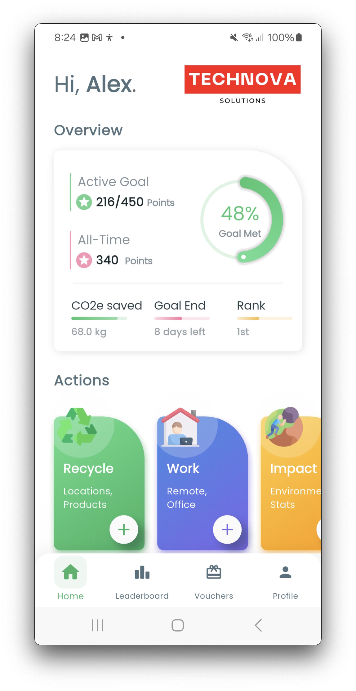
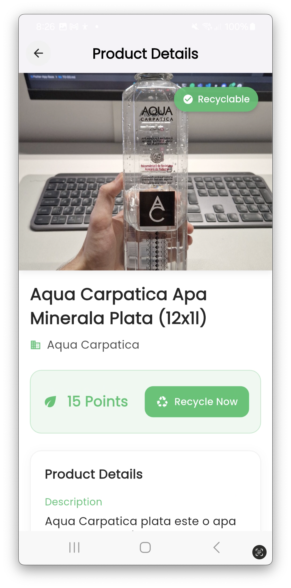
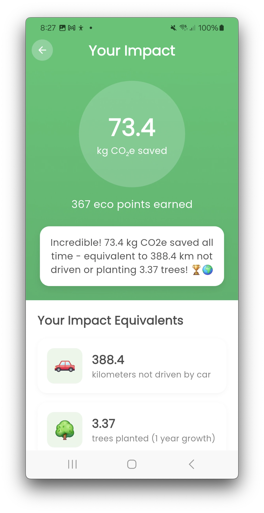
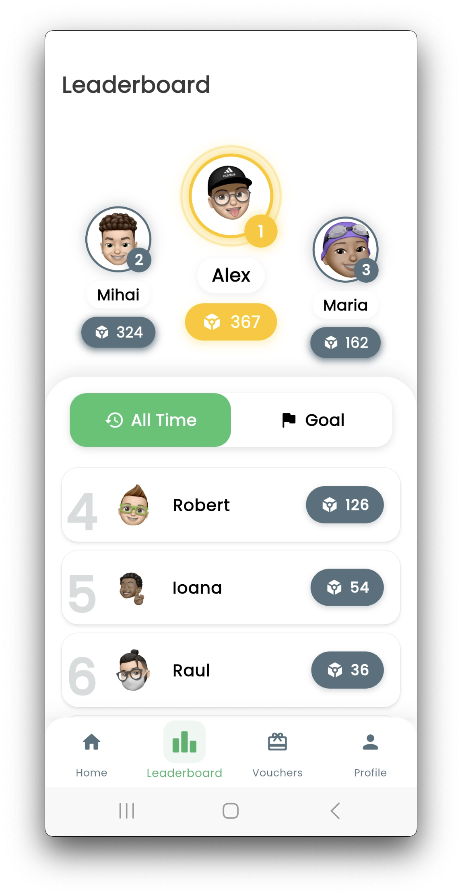
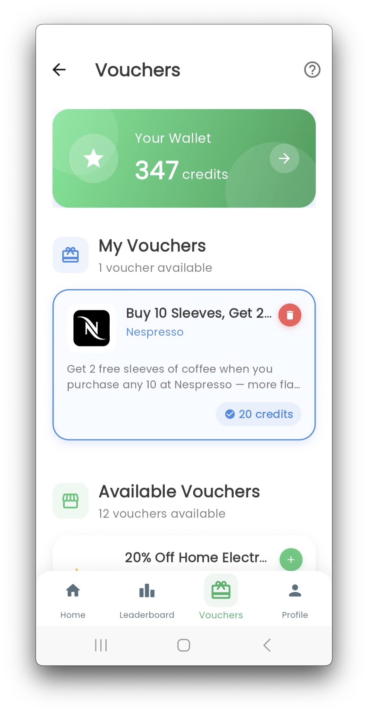

<div align="center">

# ♻️ Envira

**A Flutter mobile app that turns everyday recycling into a rewarding, gamified habit.**

Scan a product, find out if it's recyclable, earn points for recycling and remote work, track your CO₂e
impact, compete on a company leaderboard, and redeem points for real vouchers.

</div>

## Screenshots

| Home | Scan a product | Impact tracking | Leaderboard | Vouchers |
|:---:|:---:|:---:|:---:|:---:|
|  |  |  |  |  |

## What it does

- **Barcode scanning + AI recyclability check** — scan a product's barcode, look it up via the Barcode
  Lookup API, and have Google Gemini determine whether it's recyclable, which material it's made of, and
  how many points it's worth, with a plain-language explanation.
- **Points, credits & vouchers** — every recycled product and every logged remote-work day earns points;
  points convert to credits, which are redeemable for real partner vouchers (coffee, retail discounts, etc.).
- **Environmental impact dashboard** — CO₂e saved is translated into intuitive equivalents (km not driven,
  trees planted) with progress milestones.
- **Remote-work CO₂e log** — logs work-from-home days against a calendar and estimates commute/office-energy
  emissions avoided, based on distance, transport mode, and region.
- **Company leaderboard** — ranks colleagues by all-time points or by progress toward a shared company goal.
- **Nearby recycling points** — surfaces nearby recycling locations from a bundled dataset and opens them
  directly in Google Maps.
- **Firebase-backed accounts** — email/password auth with email verification, live-synced user/company data.

## Tech stack

- **Flutter / Dart** — Android app (single codebase, iOS scaffolding not yet configured).
- **Firebase** — Authentication, Cloud Firestore (real-time data), Cloud Storage (product images).
- **Google Gemini API** — product recyclability reasoning and material classification.
- **Barcode Lookup API** — product metadata from scanned barcodes.
- **NewsAPI** — in-app environmental news feed.
- **State management** — `provider` + `ChangeNotifier`, with a generic `BaseRepository<T>` / `BaseProvider<T>`
  pair that turns any Firestore collection into a live-streamed, observable list with one line of code.
- **Device integration** — camera-based barcode scanning (`mobile_scanner`), geolocation (`geolocator`),
  image picking, connectivity monitoring.

## Architecture

Feature-first modules (`lib/modules/<feature>/`) sit on top of a shared data layer (`lib/data/`), wired
together through a lightweight service locator rather than a DI framework:

```
lib/
  core/            theme, navigation, config, the service locator (global_instances.dart)
  data/            models, repositories, and stream-backed providers — shared across features
  session/         connectivity + auth gating (ConnectionGate -> AuthGate -> app shell)
  modules/         one folder per feature: authentication, home, recycle, work_log,
                    leaderboard, vouchers, environmental_impact, news, profile
```

Mutations flow through services → Firestore → the live stream → back into the UI, so the interface always
reflects the database in real time without manual refreshes.

## Project context

This started as a bachelor's thesis project and has continued to evolve since. It's a solo-built,
end-to-end product: mobile UI, Firebase backend design, third-party API integrations, and an AI-assisted
feature (product recyclability via Gemini), all shipped to a real device.

For a candid, evidence-based technical audit of the codebase (patterns, trade-offs, and known gaps) see
[docs/PROJECT_QA.md](docs/PROJECT_QA.md). Planned improvements are tracked in
[docs/ROADMAP.md](docs/ROADMAP.md).

## Running it locally

This repo pins specific Flutter/JDK/Gradle versions to keep the build reproducible, and API keys are supplied
at build time rather than committed — see **[docs/SETUP.md](docs/SETUP.md)** for the exact environment setup,
API key notes, and available commands.

```bash
fvm use 3.29.3
fvm flutter pub get
cp env.json.example env.json   # then fill in your own API keys
fvm flutter run --dart-define-from-file=env.json
```

## Contributing / working with this repo

Guidance for working in this codebase (architecture conventions, patterns to follow, gotchas) lives in
[CLAUDE.md](CLAUDE.md) — written for AI coding assistants, but equally useful as a developer's map of the
project.
